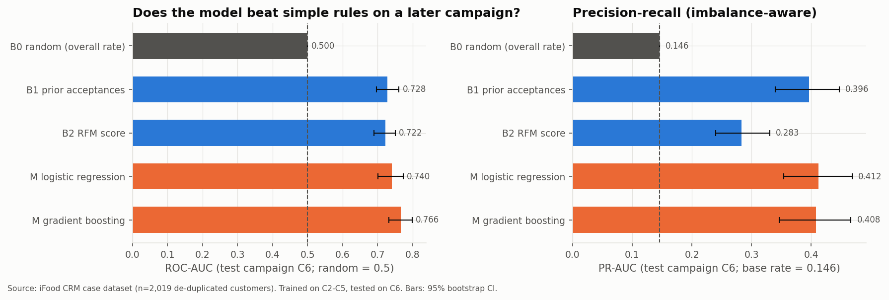
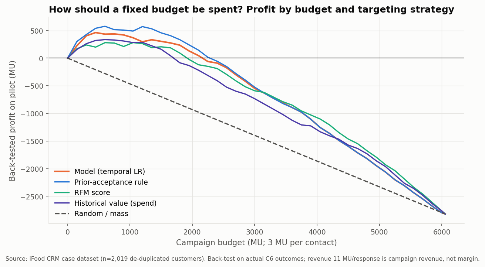
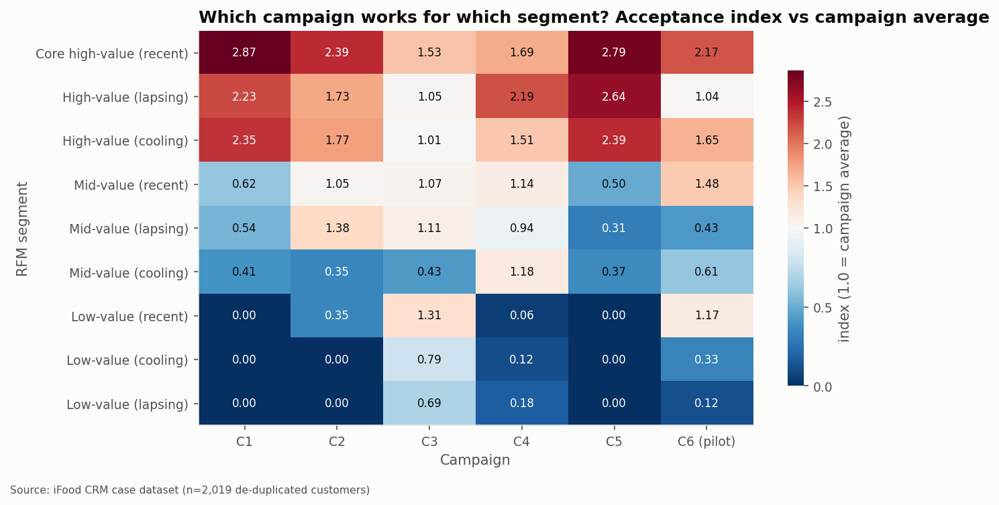
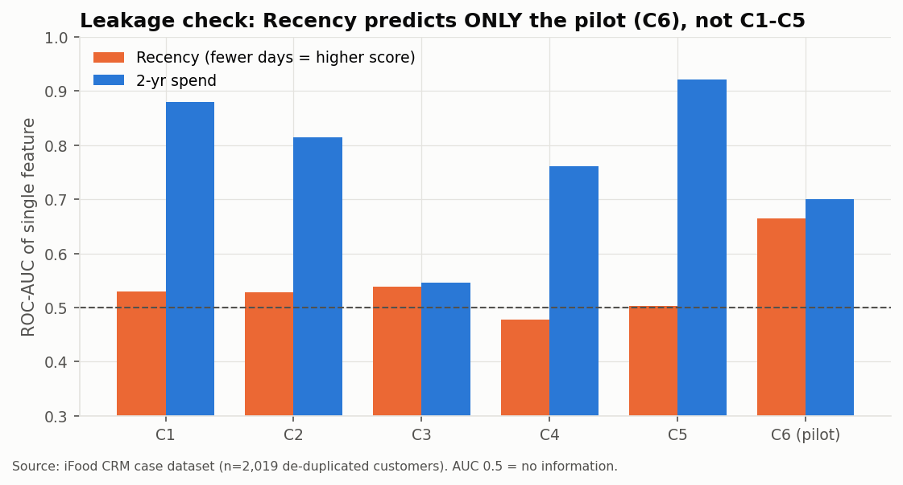

# Customer-Intelligence-and-Campaign-Optimization
**An end-to-end framework for customer intelligence, campaign response, marketing performance and resource allocation.**

> I analysed customers, campaigns and channels to determine who is valuable, who is likely to respond, which campaigns
> work for which customers, and how a limited marketing budget should be allocated — and I tested how confident each
> conclusion is.

## 1. Problem
A company ran a pilot campaign to **all** customers and lost money. Budget is limited; customers differ in value,
behaviour, campaign history and channel use. Who should get the next offer, which offer, how much should be spent — and why?

## 2. Objective & research question
*"If the company has limited marketing resources, which customers should receive marketing attention, through which
available campaign type, and why?"* — answered with evidence, uncertainty and explicit limitations.

## 3. Data
| Dataset | Role | Size | Why |
|---|---|---|---|
| **iFood CRM case** | primary: value, segments, campaigns, channels, response model, allocation | 2,240 rows → **2,019 customers** after de-duplication; 6 ordered campaigns | only candidate with multiple campaigns per customer **and** real cost (3 MU/contact) + revenue (11 MU/response) |
| **Hillstrom e-mail experiment** | secondary: causal / incremental response, campaign-type choice | 64,000, **randomised** 3 arms | only small interpretable randomised test with a choice of campaign |

## 4. Methodology & architecture


1. **Audit & cleaning** — 183 duplicate registrations and 38 conflicting-label rows removed (logged), invalid values flagged.
2. **SQL analytics** — 14 SQLite queries (CTEs, window functions, JOINs, CASE, date/rolling) answering business questions; 25/25 numbers cross-checked against pandas.
3. **Customer behaviour, RFM, segmentation** — RFM grid as the business baseline; KMeans evaluated with silhouette, elbow and bootstrap stability.
4. **Campaign & channel analytics** — pilot ROI/break-even, campaign × segment matrix (BH-corrected), purchase-channel volume vs value.
5. **Response prediction with temporal validation** — customer × campaign panel: train on C2–C5, test on the *later* pilot C6; formal [leakage audit](reports/leakage_audit.md).
6. **Customer value** — historical value and concentration (explicitly *not* CLV).
7. **Targeting engine** — five prioritisation methods back-tested; per-customer tier, action and reasons.
8. **Allocation** — budget back-test on actual outcomes, bootstrap uncertainty, marginal returns, cost/revenue sensitivity.
9. **Incremental response** — randomised treatment effects, subgroup heterogeneity, uplift vs response ranking, policy evaluation (Hillstrom).
10. **Robustness** — every headline finding classified STABLE or SENSITIVE.
<br clear="right"/>

## 5. Key findings
| # | Finding | Confidence |
|---|---|---|
| 1 | Customers who accepted an earlier campaign responded to the pilot at **40.3 %** vs **7.9 %** for everyone else. | stable |
| 2 | The pilot contacted everyone and made **−2,823 MU (ROI −47 %)**; contacting only earlier acceptors would have made **+597 MU** with 57 % of responders. | stable direction, cut-off sensitive |
| 3 | A leakage-controlled model (ROC-AUC 0.740, PR-AUC 0.412 on a later campaign) is **not significantly better** than the one-line rule (0.728 / 0.396). Boosting adds nothing on PR-AUC. | stable |
| 4 | Same-campaign cross-validation would report AUC **0.915** — inflated by a post-pilot Recency snapshot (Recency predicts only the pilot). | stable |
| 5 | Top 20 % of customers = **52 %** of spend, but high-value *lapsing* customers responded at 15 % vs 32 % for high-value *recent*. | stable |
| 6 | Most campaigns only reach affluent segments (index 2–3×); one campaign (C3) reaches low-value customers. | pattern stable, CIs wide |
| 7 | Store = 46 % of purchases but store-dominant customers respond at 6.7 %; catalog users spend most. No channel ROI is computable. | association only |
| 8 | Randomised: Mens e-mail **+$0.77**/customer vs Womens **+$0.42**; personalised assignment (+$0.888) = "best e-mail to all" (+$0.888). | ATE stable, subgroups not confirmed |
| 9 | KMeans (k = 2) separates response less than RFM → RFM kept. | stable |

<p>




</p>

## 6. Targeting framework
| Tier | Rule (chosen by back-test, no arbitrary weights) | Pilot back-test | Next campaign |
|---|---|---|---|
| **P1 Target** | accepted ≥ 1 campaign; ordered by model probability | 40.3 % response, +597 MU | 543 customers (≈ 1,629 MU) |
| **P2 Test cell** | never accepted, top 10 % model probability | 14.9 % (< 27.3 % break-even) | 148 → randomised test only |
| **P3 Suppress** | everyone else | 7.1 % | 1,328 → no paid offer |

Actions combine tier × RFM value tier (e.g. high-value non-responders → non-paid service touch, not a paid offer).
Every customer row carries evidence: campaign history, value percentile, recency, probability vs break-even,
exact log-odds drivers and purchase-channel evidence with confidence intervals.

## 7. Dashboard (Streamlit decision-support tool)
`streamlit run dashboard/app.py` — 10 pages: Executive overview · Campaign performance · Channel analytics · Customer
segmentation · Customer value · Campaign response model · **Targeting engine** (budget/tier/value/probability filters,
selection export, per-customer "why") · **Marketing allocation** (budget slider, live cost/revenue sensitivity,
hypothetical e-mail-cost scenarios) · Customer investigation · Model vs rule performance (live threshold → confusion matrix).

**Screenshots:** not included. Streamlit could not be installed in the build environment (package index blocked), so the
dashboard was verified with a headless smoke test (all 10 pages × 10 widget scenarios, every chart/table/metric checked)
rather than in a browser. After `streamlit run`, add screenshots under `docs/screenshots/`.

## 8. Business recommendations
1. **Cut the audience to P1** (543 customers ≈ 27 % of the base, ≈ 1,629 MU): expected to avoid most of the pilot's loss (back-test −2,823 → +597 MU).
2. **Keep the rule as the decision, the model as the explainer** — equal performance, far simpler.
3. **Hold out 10–20 % of P1 at random** — the iFood data are observational; incrementality is unmeasured.
4. **Choose the offer by randomised test, then send the single best offer** — personalising campaign type did not pay in the experiment.
5. **Match offer content to tier** — premium offers to high-value tiers; test a C3-style offer to develop low-value recent customers.
6. **Start recording campaign dates, delivery channel and costs** — required for channel ROI, fatigue and CLV.

## 9. Technology
Python 3.11 · pandas · NumPy · SciPy · scikit-learn · matplotlib · SQLite (window functions) · Streamlit · Jupyter-format notebooks.

## 10. Limitations
Observational iFood data (predictive, not causal); undocumented provenance with duplicates and possibly synthetic
elements; no dates or delivery channels; cost/revenue only for the pilot and revenue ≠ margin; Hillstrom is another
retailer (2008); forward probabilities assume the next campaign resembles the pilot; dashboard not browser-tested
(see §7). Full list: [`reports/final_report.md`](reports/final_report.md) §24.

## 11. Reproducibility
```bash
git clone <your-repo-url> marketing-campaign-customer-analytics && cd marketing-campaign-customer-analytics
python -m venv .venv && source .venv/bin/activate          # Windows: .venv\Scripts\activate
pip install -r requirements.txt
# download the two raw files into data/raw/ (exact names and links: data/README.md), then:
python -m src.ingestion                  # validates schema + row counts
python run_pipeline.py                   # audit → clean → features → … → SQL cross-checks (~75 s)
python tests/run_tests.py                # 11 integrity tests + dashboard smoke test (or: pytest tests/)
python tools/execute_notebooks.py        # re-executes notebooks 01–11 in place (~5 min)
streamlit run dashboard/app.py
```
Seed 42 everywhere; all outputs are deterministic.

## Repository map
```
data/            raw/ (not committed) · processed/ (generated) · README.md (download + schema)
notebooks/       01_data_audit … 11_robustness_analysis (executed, thin layers over src/)
src/             ingestion · data_validation · preprocessing · feature_engineering · rfm · segmentation ·
                 campaign_analysis · response_model · customer_value · targeting · optimization · uplift ·
                 robustness · evaluation · visualization · sql_runner · pipeline · config
sql/             marketing_analytics.sql (14 business queries)
dashboard/       app.py · data.py · assets/architecture.png
outputs/         figures/ (24 charts) · tables/ (~90 CSVs + key_metrics.json + sql/) · models/ (joblib)
reports/         data_audit · leakage_audit · methodology · findings · final_report
tests/           test_pipeline.py · test_dashboard_smoke.py · streamlit_stub.py · run_tests.py
tools/           build_notebooks.py · execute_notebooks.py · make_architecture.py
```
